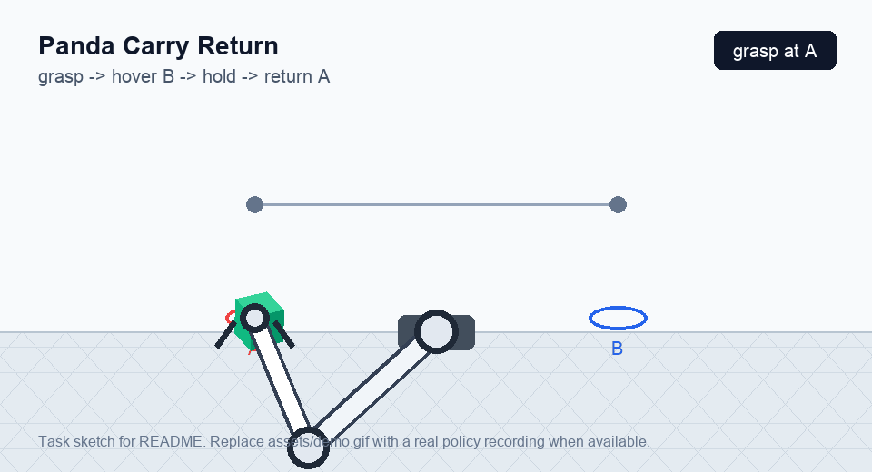

# Panda Carry Return

This is a small MuJoCo Playground experiment for a Franka Panda arm.

Task:

1. Grasp the cube at A.
2. Lift the cube while keeping it grasped.
3. Carry it to a hover point above B.
4. Hold at B for several simulation steps.
5. Carry it back to a hover point above A.
6. Hold at A to finish the task.

The task is intentionally not a table placement task. The environment uses a
floor plane, so the learned behavior should keep holding the cube instead of
dropping it at B.

## Demo



This GIF is a task sketch for the README. Replace `assets/demo.gif` with a
recording from the trained policy when a good rollout is available.

## Files

- `train_panda_ab.py`: staged PPO training for the carry-and-return task.
- `panda_env_view.py`: quick viewer script for inspecting the Panda environment.

Policy `.pkl` files are treated as training artifacts and are ignored by Git.

## Requirements

This project expects MuJoCo Playground and its dependencies to be installed.
One convenient workflow is to keep this folder next to a local
`mujoco_playground` checkout and run commands from an environment where that
package is importable.

## Run

```bash
uv run mjpython train_panda_ab.py
```

To inspect the base environment:

```bash
uv run mjpython panda_env_view.py
```
